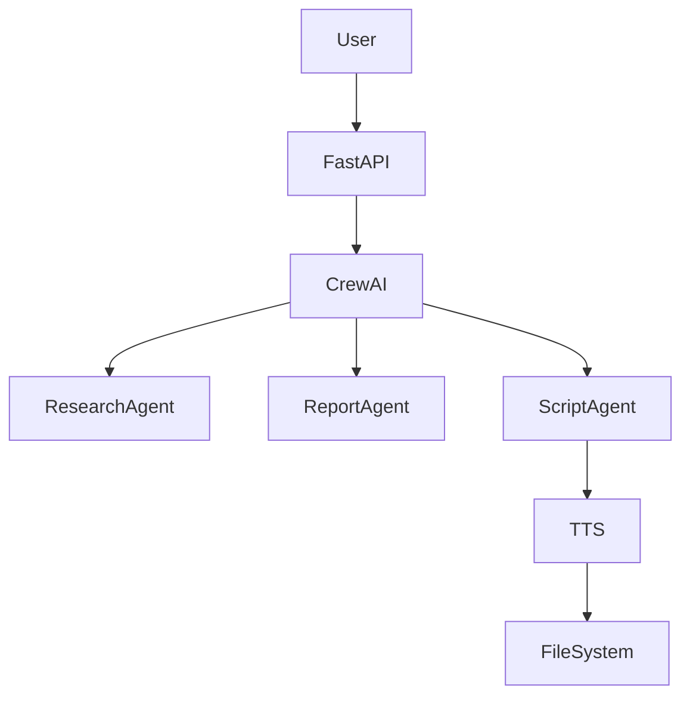
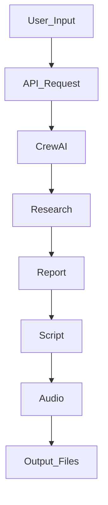

# 🚀 AI Podcast Generator (Multi-Agent System)

> Automatically generates a complete podcast (research → script → audio) using AI agents.

---

# 📌 Overview

This project is a multi-agent AI system that automates the entire podcast creation pipeline—from topic input to final audio output.

Instead of manually researching, writing scripts, and recording audio, this system uses AI agents to perform each step automatically. It leverages CrewAI for orchestration, LLMs for content generation, and offline text-to-speech for audio creation.

It is built for developers exploring **AI systems, agent orchestration, and real-world LLM pipelines**.

---

# 🎥 Demo / Screenshots

## 🔹 FastAPI Swagger UI (API Trigger)


## 🔹 Agent Execution (Terminal Logs)


---

# ✨ Features

## Core Features

* Topic-based podcast generation
* Automated research → report → script → audio pipeline
* FastAPI endpoint for triggering workflows
* Offline TTS using pyttsx3

## Advanced Features

* Multi-agent orchestration using CrewAI
* Tool integration (search, file handling, TTS)
* Context passing between agents
* Modular and extensible architecture

---

# 🏗 Architecture



---

# 🔄 System Workflow



---

# 🛠 Tech Stack

| Layer     | Technology   |
| --------- | ------------ |
| Backend   | FastAPI      |
| AI Agents | CrewAI       |
| LLM       | Hugging Face |
| TTS       | pyttsx3      |
| Tools     | Serper API   |
| Config    | dotenv       |

---

# 📂 Project Structure

```
podcaster_crew_production/

├── src/podcaster/
│   ├── crew.py
│   ├── main.py
│   ├── tools/
│   ├── config/
│   └── __init__.py
├── outputs/           # generated files
├── api.py
├── requirements.txt
├── .env
```

---

# ⚙️ Installation

### 1 Clone the repository

```
git clone https://github.com/yourusername/ai-podcast-generator.git
```

### 2 Navigate to project

```
cd ai-podcast-generator
```

### 3 Create virtual environment

```
python -m venv venv
venv\\Scripts\\activate
```

### 4 Install dependencies

```
pip install -r requirements.txt
```

### 5 Run API server

```
uvicorn api:app --reload
```

---

# 🔌 API Endpoints

## 🎙 Generate Podcast

```
POST /generate-podcast?topic=YourTopic
```

Example:

```
/generate-podcast?topic=Future of Cybersecurity
```

---

# 📊 Performance Considerations

* LLM latency is the main bottleneck
* Sequential pipeline ensures correctness
* Can be optimized with parallel agents
* Future scope for caching and async execution

---

# 🗺 Roadmap

* Add async execution (Celery)
* Add caching layer
* Store outputs in cloud (S3)
* Add authentication layer

---

# 👨‍💻 Author

Harsh Verma
GitHub: [https://github.com/harsh-verma-2004](https://github.com/harsh-verma-2004)

---

# ⭐ Support

If you like this project, consider giving it a star ⭐
